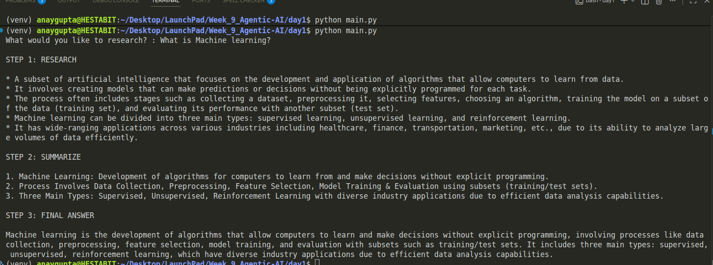

# WEEK 9 – DAY 1

# AGENT FOUNDATIONS + MESSAGE-BASED COMMUNICATION

---

## 1. Objective of Day 1

The goal of Day 1 was to understand:

- What an AI Agent is
- Difference between Agent, Chatbot, and Pipeline
- Message-based communication between agents
- Role-based separation
- Basic multi-agent architecture

We implemented a simple 3-agent system to simulate structured AI reasoning.

---

## 2. What is an AI Agent?

An AI Agent is a system that:

- Receives input
- Performs reasoning
- Produces an output
- Follows a defined role or objective

Unlike a chatbot, an agent:

- Has a specific responsibility
- Operates under constraints
- Can be part of a larger system

Agent behavior follows a loop:

Perception → Reasoning → Action

---

## 3. Agent vs Chatbot vs Pipeline

### Chatbot

- Single model
- One prompt
- Responds directly to user
- No structured internal roles

### Pipeline

- Fixed sequence of steps
- Hardcoded flow
- No dynamic decision making

### Agent System

- Role-based intelligence
- Clear separation of responsibility
- Message passing between agents
- Scalable to multi-agent orchestration

---

## 4. What We Built

We implemented a 3-agent linear pipeline:

User  
↓  
Research Agent  
↓  
Summarizer Agent  
↓  
Answer Agent  
↓  
Final Output

---

## 5. Agent Responsibilities

### 🔹 Research Agent

- Collects factual information
- Maximum 5 bullet points
- No summarization
- No answering

### 🔹 Summarizer Agent

- Compresses research output
- Exactly 3 bullet points
- Removes redundancy

### 🔹 Answer Agent

- Receives original question + summary
- Produces final concise answer
- Uses only provided summary
- No new information added

---

## 6. Key Concepts Practiced

- Role isolation
- System prompt design
- Controlled LLM behavior
- Message passing between agents
- Deterministic output (low temperature)
- Clean separation of duties

---

## 7. Architecture Flow

We implemented a 3-agent linear pipeline:

User  
↓  
Research Agent  
↓  
Summarizer Agent  
↓  
Answer Agent  
↓  
Final Output

---

This is a linear multi-agent system.

---

## 8. Execution Result

Below is the output after running the pipeline:

---

## 9. What We Learned

- Prompts must be strict for controlled behavior
- Passing original user query to final agent is critical
- Role separation reduces hallucination
- Multi-agent systems improve structure over single-model systems
- Even simple orchestration improves clarity and modularity

---

## 10. Limitations of Day 1 System

- Linear pipeline (not dynamic)
- No task planning
- No reflection step
- No validation agent
- No memory system
- No parallel execution

These will be improved in Day 2 and beyond.

---

# Conclusion

Day 1 focused on building foundational understanding of agent architecture.

We moved from:
Simple LLM call  
→ Structured multi-agent reasoning pipeline

This forms the base for advanced orchestration in Day 2.
